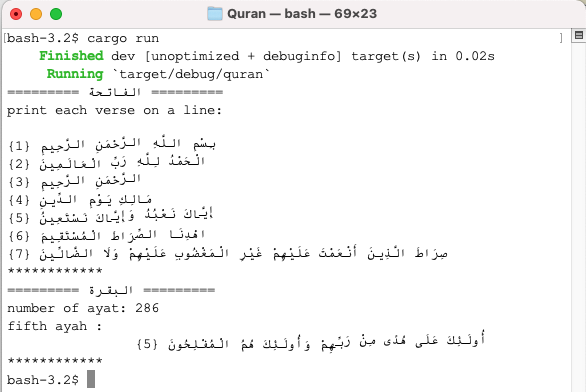

# Quran
 
# A Quran Library written in rust. 
- The goal of the project is to provide functions to help with the development of Islamic and Arabic applications  
- Implementation will be done in rust to allow compilation and generation of native libraries that can be used effeciently from any other programming language.

## Status of the Project
The project is still in its early stages,    
Currently the library provides a basic parser which reads the Quran data from the file src/data/quran.txt,   
and builds a syntax tree consisting of three types of elements: Surah (Chapter), Ayah (Verse), Word.


To run a quick test : 
    ````
    $   cargo run > output.txt
    ````

Open output.txt using an editor, and switch the writing direction to "Right to Left". 

Or use a terminal that supports Arabic, following screen shot shows the application running on MacOS Terminal.app. 




## Current Todo items
- [x] generate Quran data file in text format
- [ ] data file transformation: transform to other formats such as json and xml 
- [ ] serialize the data 
- [ ] add functions to process the data


## Suggested Features
- [ ] Auto correction
- [ ] Auto completion 
- [ ] Data extraction and transformation 
- [ ] Tajweed
- [ ] Recognition 
- [ ] Intigration with other libraries and future projects, such as Arabic grammar , Tafseer, Hadeeth ...etc
- [ ] APIs
- [ ] Syntax highlighting 
- [ ] Tools
